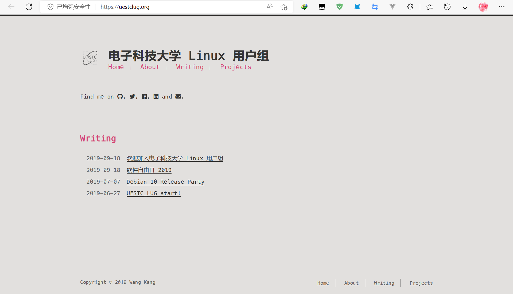
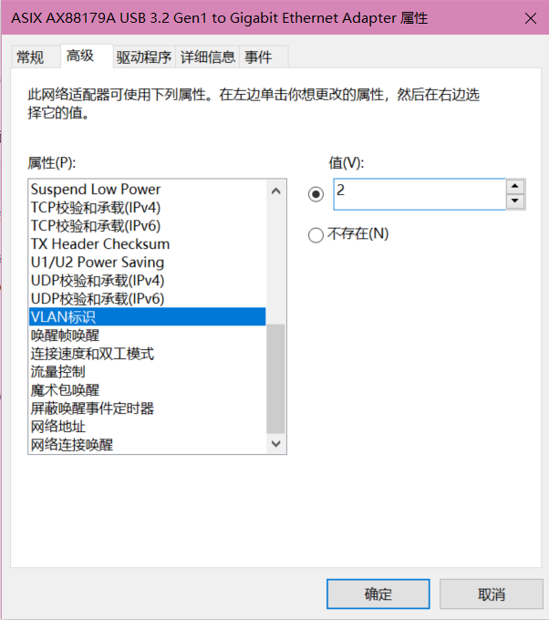
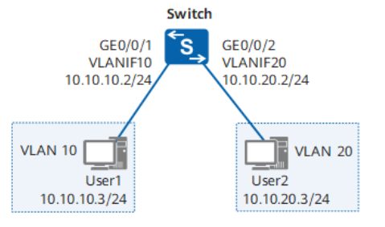
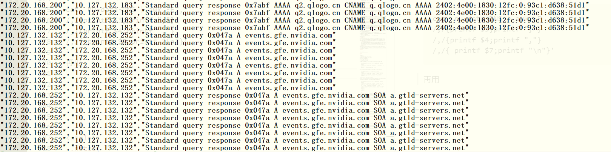
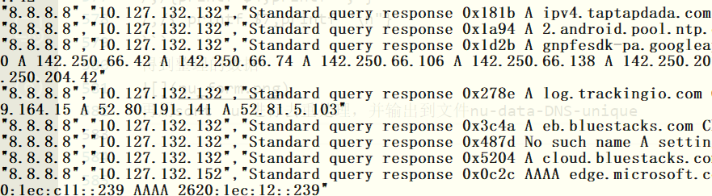
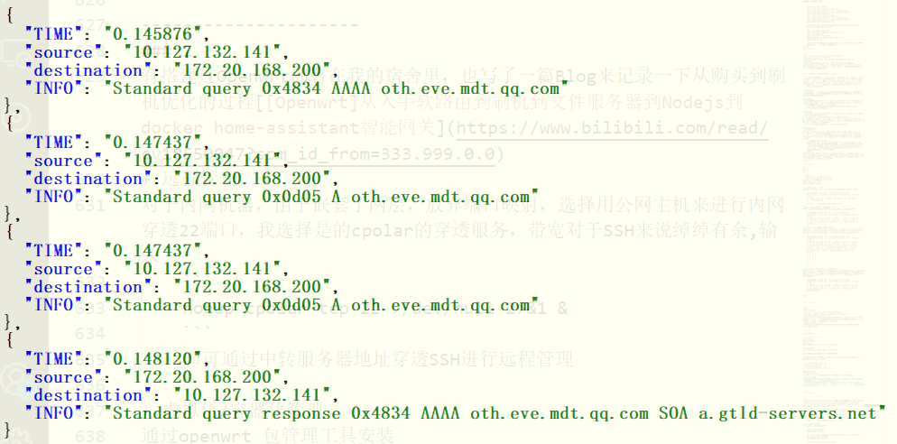

# 回答：

## 基础题：
### 导航：

<a href="#j1">基础题:</a><br>

<a href="#j1">1. 简述以下协议位于 TCP/IP 参考模型的哪⼀层，并给出相应的应用和特点。</a><br>
<a href="#j2">2. ⼀台设备没有配置默认 IPv4/IPv6 路由，如何⼿动配置令其能够访问外部网络？</a><br>
<a href="#j3">3. 简述 DHCP 下发 IPv4 地址的流程，简述 SLAAC 下发 IPv6 地址的流程。</a><br>
<a href="#j4">4. 结合实际应用，简述 Unicast, Multicast, Anycast, Broadcast 的内容和用途。</a><br>
<a href="#j5">5. 以下是某位同学使用 ip a 命令的结果，试分析其中包含哪些、哪类地址，据此可以推测出本地网
络的哪些信息？</a><br>
<a href="#j6">6. 请简述⼀个位于办公室局域网内的 PC 客户端设备访问 https://uestclug.org 服务器时，可能使用
到了哪些网络协议，它们是怎样运作的？简述流量的路径。</a><br>
<a href="#j7">7. 当⼀台主机（电脑）连接到某台交换机的 Trunk ⼝上时，有⼏种⽅式使它能与外界通信？</a><br>
<a href="#j8">8. 写出 OSI 七层模型（或 TCP/IP 四层模型），并分别写出每⼀层对数据的处理过程（添加了哪些信
息）以及数据在每⼀层存在的形式（即每⼀层的 PDU）。</a><br>
<a href="#j9">9. 请简述⼆层交换机、三层交换机、路由器之间的区别，以及它们⼀般被部署在网络的哪些位置上。</a><br>
<a href="#j10">
10. 同⼀交换机上的 VLAN 之间如何进⾏数据通信？
</a><br>
<a href="#j11">11. 什么是 NAT？在网络中使用 NAT 有哪些好处和坏处？简述 SNAT DNAT 的含义和用途，并解释何
种情况下需要使用 MASQUERADE NAT。</a><br>
<a href="#j12">12. 某个办公室通过企业内部网络与服务器机房相连（均为私有 IP 段），请简述当发⽣下列事件时，
使用 mtr 或 traceroute 等路由跟踪⼯具可能会看到的异常状况。</a><br>
<a href="#j13">13. 尝试从您的寝室出发，画出您推测的电⼦科技⼤学网络拓扑。</a><br><br>
<a href="#x1">选做题:</a><br>

<a href="#x1">1. 请写⼀个 shell 脚本，按照如下要求，将 NU 的网络流量样本（1分钟） 进行处理。</a><br>
<a href="#x2">2. 您是否搭建/维护过个⼈/家庭/企业的网络？如果有，请简述（如果有 Blog ⽂章的话更好）:</a><br>


<div id="j1">

---------------
### 1:
A.<b>HTTP</b>:  
位于TCP/IP参考模型中的应用层  
<b>应用</b>:主要用于Web开发,用来发送和接受HTML页面,客户端主要服务于edge,chrome,opera,safari,旧版基于TCP之上,http/3则是基于UDP,监听端口一般是80。  
<b>特点</b>:它是无连接，无状态的 ,明文传输的内容，不是很安全，所以后面基于ssl开发了https协议。URL格式为http://IP:80  

B. <b>SMTP</b>  
它也位于该模型的应用层  
<b>应用:</b>它被用于电子邮件的传输, 基于FTP协议，主要用于邮件消息中转，也可以提供来信通知  
<b>特点:</b>常用端口25，主要是单向发送  

C.  <b>TCP</b>    
它位于该模型的传输层  
<b>应用:</b>TCP/IP协议中最重要的协议之一，应用于数据传输，HTTP、FTP、SMTP、TELNET、SSH等协议都是基于TCP协议。由于TCP是可靠的，通常用于远程连接、文本传输、等对数据内容要求可靠的场景。    
<b>特点:</b>有状态，TCP只能点对点建立连接，无法一对多，TCP协议全双工，能一边发一边收，TCP连接是可靠的，建立连接时需要三次握手，断开连接需要四次挥手，每一次数据传输都要校验和，如果校验失败则丢弃包并且返回错误的包序号ack，之后进入重传。如果超时也会重传。TCP还具有流量控制，窗口发送速度由最慢的一方决定，并且能对流量拥塞控制。付出带宽比UDP高，延迟高，不适合即时性要求高的场合  

D.  <b>DNS</b>  
DNS位于应用层  
<b>应用:</b>域名解析系统，用来解析域名的IP地址，最开始只是为了方便人类记忆网址，后来发现可以用于分布式布局，在各地建立不同的CDN服务器，对于不同地区的IP解析最近的CDN，以此提高客户端访问资源速度，避免长距离传输带来的高延迟和丢包  
<b>特点:</b>通常基于UDP协议，分布式存储，常用端口是53，具有域名分层系统，单纯的DNS协议很容易被劫持，因为任何一个上游DNS都可以回答请求报文，所以出现了DoT和DoH即基于Tls和Https 加密传输，对于一些国外网站防DNS污染效果显著


E.  <b>UDP</b>  
UDP属于TCP/IP中的传输层
<b>应用:</b>常用于高即时性，数据完整性要求低，可分块传输，高带宽等传输场景，例如：视频会议，FPS游戏，视频传输，语音传输  
<b>特点:</b>面向非连接的，不可靠的，最大的优点就是延迟低，带宽花费远小于TCP，不具有状态和超时重传机制，只有校验机制，不需要握手协商即可向服务器发送UDP报文  

F.  <b>ICMP</b>   
它位于网络层  
<b>应用:</b>最常用的是ping命令，win端使用则默认发送和接收4个ICMP，用于确认是否能发送数据包到对方主机，也可以用来ping 回环地址 127.0.0.1 ，用来确认自己的网卡是否出现故障。tracert命令也基于ICMP，用于追踪数据经过的路由。DOS攻击常用协议  
<b>特点:</b>只能基于IPv4，是一个差错报告机制，不能纠正差错，只负责报告

G.  <b>ARP</b>  
位于TCP/IP的网络层  
<b>应用:</b>主要用于局域网中获取MAC地址，用于IP地址到MAC地址的转换  
<b>特点:</b> 由于采用广播的方式进行询问MAC地址，并不安全，很容易被攻击

H.  <b>RDP</b>  
位于TCP/IP的应用层 
<b>应用:</b>主要用于远程连接服务器，windows端自带应用Remote Desktop Connection，所有计算都在被连接的服务器完成，即使服务器端没有显卡也能在客户端显示画面
<b>特点:</b> 基于TCP，端口默认3389，容易被攻击，传送文件方便，能够进行完全代理。微软曾爆出高危安全漏洞，配合防火墙使用。
<div id="j2">

---------------------
### 2:

+ 首先，有可能没有配置默认路由有可能是该设备没有设置DHCP自动获取网关、IP等配置,检查并修改该设备接口为自动获取网关、IP地址、子网掩码、DNS服务器。linux一般在/etc/config/network里做配置，修改WAN口为 `option proto 'dhcp'` ，windows下可以按win + x => w => 更改适配器选项 => 网络连接 => WLAN =>属性 => 双击IPv4    
+ 如果没有自动配置路由，在已经知道路由器IP地址的情况下，则可以手动添加一条路由，网关为路由器IP，根据网络号主机号来确定子网掩码，通常使用255.255.255.0或者是255.255.0.0，ip地址选择网段下的一个闲置主机号即可
如果是windows就可以cmd输入`
route ADD "你的IP" MASK "子网掩码" "网关地址" 
METRIC 3`
例如设置缺省路由到网关10.0.0.1：
    ```js
    route add 0.0.0.0 mask 0.0.0.0 10.0.0.1 METRIC 3
    ```

+ 这样所有的数据包都会发到上级网关，同样的上级网关也设置缺省静态路由到ISP上级网关

<div id="j3">

---------------------
### 3:  
<br>参考文章：[1][https://www.cnblogs.com/tlnshuju/p/7356311.html](https://www.cnblogs.com/tlnshuju/p/7356311.html)<br>
[2]https://www.networkacademy.io/ccna/ipv6/stateless-address-autoconfiguration-slaac


`[1]`DHCP下发IPv4地址的过程分为以下四步:  
1. 客户机请求IP  
当一个客户机设置DHCP获取路由时候，它会把自己的IP设置为0.0.0.0，以源地址0.0.0.0，源端口68，向受限广播地址`255.255.255.255`发出UDP广播，端口是默认的67端口。广播的数据报中包含客户机的MAC地址和计算机名，来标识自己的身份  
2. DHCP服务器响应广播  
当局域网中有一台DHCP(多台会发生冲突)，当DHCP服务器收到广播包时，它会先从IP地址池里寻找是否有空闲IP地址，如果有，则封装客户机的MAC地址和分配的IP地址并广播，因为客户机还没有IP地址，所以目标IP为`255.255.255.255`来广播通告此MAC地址设备的IP地址  
3. 客户机确认使用此IP地址  
当DHCP服务器广播此闲置IP后会保留该IP地址以防止二次分配，并等待客户机确认使用IP的广播。客户机如果拒绝会广播给DHCP服务器，则DHCP服务器会回收此IP地址。如果客户机接受此IP地址，那么客户机就会广播`255.255.255.255` DHCPREQUEST包信息
4. DHCP服务器收到确认信息，确认分配租约
DHCP服务器收到确认使用此IP的报文后，保留分配的IP地址，生成租约过期时间、网关IP、子网掩码、DNS服务器(如果有)，并依旧使用广播地址`255.255.255.255`广播通知客户机，客户机收到后保存DHCP信息到本地，此时DHCP分配完成，客户机获得这些信息后写入本地，整个DHCP下发IPv4流程完成，租约过期前DHCP分配的IP地址都不会变化，DHCP服务器被分配的IP地址也不会被二次分配，从闲置的地址池中移出
 
`[2]`SLAAC下发IPv6的过程  
<br>
SLAAC意思是Stateless Address Autoconfiguration无状态地址自动配置，它是一种用来生成独一无二的IP地址而不需要任何设备追踪哪个地址分给哪个节点的机制，以下是SLAAC分配的流程：
1. 当开启了IPv6的客户机PC1连接到网络后，客户机使用本机链路地址配置自己的地址，自动配置通常用的方法是将链路本地前缀 FE80::/64 和 EUI-64 接口标识符进行结合来产生本地IPv6地址
    + EUI-64生成接口标识符的流程
    1. 用参考链接的MAC地址`7007.1234.5678`举例，
    第一步是获取设备的MAC地址
    2. 在MAC地址中间插入0xFFFE变成  
    7007.12`FFFE`34.5678
    3. 把前两位"0x70"转成"0b01110000",翻转第七位变成
    "0b011100<b>1</b>0, "即为"0x72"
    4. 把其和FE80::结合起来得到PC1的IPv6地址为：  
    FE80:: 7207.12FF.FE34.5678
2. 进行DAD 即Duplicate Address Detection，重复地址
检测，由于根据MAC地址生成的IPv6地址重复的可能性非常小，但还是需要检测机制，DAD应运而生  
    + 配置IPv6地址后，会自动加入一个特殊的多播组，地址由FF02::1:FF与IPv6地址后六位拼接组成，对于例子的IPv6地址FE80:: 7207.12FF.FE34.5678，后六位为34.5678，拼接后得到多播地址为`FF02::1:FF34:5678`
    netsh命令可以查看加入的多播组
        ```
        netsh interface ipv6 show joins
        ```
    + 对于后IPv6地址后六位相同的设备，会加入同一个多播组。所以要想检测是否是唯一的IPv
    6地址，PC1需要向这个多播地址发送ICMPv6数据报，源地址是未指定的"::"，数据报里面包含了完整的地址信息，当且仅当只有正在侦听此自动生成的多播组的节点设备才会打开数据包，并拆包查看地址和自己的是不是完全一致，如果一致，就会回复一个消息说这个地址有人用了，如果PC1等待周期结束后没有收到回复，那么就认为这个地址是独一无二的并且可以使用，于是就注册这个地址为正式使用的地址了
3. 第一第二步，产生了一个独一无二的本地链路地址，由于没有这个地址就没法和第三层设备沟通，所以前两部算是配置SLAAC工作的先决条件。接下来PC1发一个叫RS的ICMPv6数据包，其实就是路由请求数据包，内容是询问此网段的全局单播前缀信息，目标地址是FF02::2，当监听这个组播地址FF02::2的路由收到后，会返给PC1一个叫做RA的ICMPv6包，内容是链路上的全局 IPv6 前缀和前缀长度，这里的前缀是`2001:1234:A:b::`，前缀长度是`/64`

4. PC1收到后就把他们和之前生成的EUI标识符结合起来，变成:
    `2001:1234:A:B:7207:12FF:FE34:5678/64`
    又因为RA来自路由1，所以这里网关也设置为路由1的链路本地地址
5. 再进行一次DAD，以确保此这个自动生成的地址是独一无二的，PC1向FF02::1:FF34:5678组播地址发送ICMPv6包询问，如果没有设备回应，就认为这个地址是独一无二的，并且在互联网使用这个地址，自此SLAAC分配IPv6地址完成
    

<div id="j4">


---------------------
### 4:  
<br>参考文章：<br>[1][https://en.wikipedia.org/wiki/Unicast]<br>
[2][https://zh.wikipedia.org/wiki/%E5%A4%9A%E6%92%AD
]<br>
[3][https://zh.wikipedia.org/wiki/%E4%BB%BB%E6%92%AD
]<br>
[4][https://www.hi-linux.com/posts/26571.html
]<br>
<b>Unicast:</b>  
+ Unicast 是单播技术，用来点对点通讯，使用时只有<b>一个</b>发送方和<b>一个</b>接收方，互联网中其他的设备不参与通讯，通常使用TCP和UDP传输报文。  
Unicast 通常用于对用户身份认证  
它的优点是能及时响应客户端，点对点比较安全，并且数据可以进行差异化修改，缺点也很明显，非常的占用资源

<b>Multicast:</b>  
+ Multicast 是组播技术，它可以信息同时传给一组有相同特性的目的用户，例如：认证过的缴费用户。主要应用在IP多播  
Multicast 常用于IPTV、多点视频会议，无线通讯  
它的多播技术可以减少带宽损耗，提高效率，但安全性是最大的问题，因为它采用对称加密，容易被窃听以及解密加密后传输的内容

<b>Anycast:</b>  
+ Anycast 是任意播技术，Wiki上解释，它是一种网络寻址和路由的策略, “[4]Anycast 将一个单播地址分配到处于Internet 中多个不同物理位置的主机上，发送到这个主机的报文被网络路由到路由协议度量的最近的目标主机上。”<div class="notes"> <i>(注：这一段解释Anycast的原文足够精简准确描述任播技术，只能复制粘贴了)</i></div>
Anycast 在DNS领域有典型的应用，当客户端使用BGP协议向首选根DNS服务器发出请求，使用了任意播技术的服务端就可以通过判断客户端的物理位置，从而选择最靠近客户端的服务器来响应请求，这就能一定程度上优化响应速度，和服务端的负载均衡  

<b>Broadcast:</b>
+ Broadcast是广播技术，基于UDP协议，它指的是将一个消息发送给一个子网中的所有设备，每个设备都会收到广播消息，其中广播IP地址为该子网网段的最后一个主机号IP例如处于10.0.0.0/24网段的所有设备的广播地址为10.0.0.255，如果设备不知道自己的IP网段，那么就向255.255.255.255这个受限的广播地址发送配置IP请求。收到IP地址广播的路由器会重新打包路由给所有子网下的设备。   
广播的MAC地址为ff:ff:ff:ff:ff:ff，路由器会阻止MAC地址广播  
Broadcast技术在网络中有许多应用，比如ARP协议，用来建立IP和MAC地址的映射关系，广播技术的模型很简单，但缺点也很致命，消耗的资源很大，如果局域网下有很多的设备，每一次广播都要转发给所有子网设备，对路由器负载能力要求极高，同时安全性也很低，如果是明文数据报更是毫无隐私可言，所以这种方式在子网设备容纳量急剧增加的IPv6中被组播所取代

<div id="j5">

---------------------
### 5:  
参考链接：<br>[1]https://www.jianshu.com/p/7466862382c4<br>
1. `enp42s0 `<br>
表示网络接口名是enp42s0<br><br>
2.  `<BROADCAST,MULTICAST,UP,LOWER_UP>` <br>    `BROADCAST`表示这个网卡拥有广播地址，可以发送广播包，`MULTICAST`代表网卡可以发送多播包,`UP`表示此网络接口已经启用，`LOWER_UP`代表该网络接口已经上电<br><br>
3. `MTU 1500`<br>代表最大传输单元为1500字节，表明这是网络层的IP<br><br>
4. `qdisc fq_codel`<br>表示数据包排队规则为fq_codel规则，即<b>流队列控制延迟</b>，通过设置DRR调度机制，合理调整发包顺序，防止小的数据包被大数据包阻塞，降低RTT，提高吞吐量，<br><br>
5. `state UP`<br>表示网络接口已启用<br><br>
6. `group default`<br>表示接口组是默认接口<br><br>
7. `qlen 1000`<br>表示传输队列长度为1000<br><br>
8. `link/ether d8:bb:c1:16:db:e1`<br>表示此接口的MAC地址为：d8:bb:c1:16:db:e1<br><br>
9. `brd ff:ff:ff:ff:ff:ff`<br>表示此接口的广播MAC地址为： ff:ff:ff:ff:ff:ff<br><br>
10. `inet 10.127.132.244/25 brd 10.127.132.255`<br>
其中`inet 10.127.132.244/25`，表示该网卡IPv4地址为:10.127.132.244,其中`/25`表示子网掩码位是25位，即11111111 11111111 11111111 10000000, 也可以写成255.255.255.128，和IP地址进行按位与运算即可知道网络号为10.127.132.128，主机号为244，根据10.x.x.x.网段可以得知这是一台处于局域网的电脑 <br>`brd 10.127.132.255`表示广播IP地址为 10.127.132.255<br><br>
11. `scope global dynamic noprefixroute`<br>其中`global`代表全局有效的,`dynamic`代表是动态的,`noprefixroute`表示无前缀路由，意思是不为该地址的网络前缀分配路由<br><br>
12. `valid_lft 166763sec preferred_lft 166763sec`<br>
其中`valid_lft 166763sec` 表示IP地址有效时间为166763秒 , `preferred_lft 166763sec` 表示首选 生存期为166763秒<br><br>
13. `inet6 P2a0c:b641:7a2:1020:fc5d:264:c441:344f/64 scope global dynamic noprefixroute`<br>
其中`inet6 2a0c:b641:7a2:1020:fc5d:264:c441:344f`表示该网络接口的IPv6地址为：2a0c:b641:7a2:1020:fc5d:264:c441:344f<br><br>
`/64`表示该IPv6子网掩码位是64位，剩下的之前已经说明
14. `valid_lft 299956sec preferred_lft 199956sec`<br>
同样的，`valid_lft` 代表IP地址有效时间,`preferred_lft`代表IP地址首选有效时间<br><br>
15. `inet6 fe80::9e66:54c1:6c67:7ea2/64 scope link noprefixroute valid_lft forever preferred_lft forever`<br>
表示第二个IPv6地址为fe80::9e66:54c1:6c67:7ea2，子网掩码位是64位`scope link`表示仅在该设备上有效，`valid_lft forever preferred_lft forever`表示此IPv6有效时间是永久，首选有效时间也是永久

<div id="j6">

---------------------
### 6:  
参考链接：<br>
[1][https://www.bilibili.com/video/BV1KY411x7Jp/?spm_id_from=333.337.search-card.all.click&vd_source=347109678632e4593a175ba64105c5ff]
[2][https://zhuanlan.zhihu.com/p/399105434]

<div class="notes"><i>(注：访问一个https涉及的协议可能非常的多，并且有可能是并发进行的，所以这里不选择使用数字排序，并且为了更好阐述,使用拟人人称描述，以下的“你”均指的是处于办公室局域网的PC端)</i>
</div><br>

<div id="transProtocol">先找到简单数据包传输路径和可能使用的协议：</div>

+ 首先，从位于教学区连上的UESTC-WiFi开始说起，此时你没有IP地址，所以你向受限广播地址255.255.255.255请求DHCP服务器，握手的过程使用了<b>DHCP协议</b>，此时假设一切正常，你成功连上互联网，并且分配到了IP地址等配置<br><br>
+ 你使用cmd输入`ipconfig /all`后，发现自己的IP地址是`10.0.0.201`，显然它是一个内网网段,这时候你可能使用了<b>NAT网络地址转换</b>。你用tracert命令查询流量路径
    ```
    C:\Users\Onion>tracert  223.5.5.5
    通过最多 30 个跃点跟踪到 223.5.5.5 的路由

  1     1 ms     1 ms     1 ms  10.0.0.1
  2     4 ms     4 ms     3 ms  172.16.0.1
  3     *       14 ms     *     111.9.15.77
  4     6 ms     6 ms     6 ms  223.87.26.29
  5     7 ms     *        *     211.137.98.50
  6     6 ms     6 ms     6 ms  183.221.35.98
  7     6 ms     6 ms     6 ms  116.251.119.129
  8     8 ms     7 ms     7 ms  116.251.118.121
  9     *        *        *     请求超时。
  10     *        *        *     请求超时。
  11     5 ms     6 ms     6 ms  223.5.5.5
 
    ```
    你发现流量第一级发到了`10.0.0.1`它是你的上级网关，你可能用了<b>ARP</b>协议，它的上级网关是`172.16.0.1`，这也是一个内网IP地址，所以此时可能有两层NAT地址转换，分别对应把10.0.0.0网段转换成172.16.0.1的IP地址，和把172.16.0.0网段转成公网IP `111.9.15.77`。<br>于是此时你知道简单数据包的路径走向是通过至少两层内网NAT转换，也就是每次你要和外网发送数据包，其中对外的IP地址都被转换至少两次，每次收到数据包也要经过逆向转换  
    其中封装好的传输层数据包在跳转的路由中间使用了<b>TCP和UDP协议</b><br><br>关于TCP协议三次握手四次挥手,之前第一题讲过了不再赘述：[https://zhuanlan.zhihu.com/p/40013850](https://)<br>
    UDP协议的路径就只有单向发送，无重传机制，有校验机制

再找到访问URL的数据传输的路径:
+ 当你在URL地址栏输入`https://uestclug.org`的URL链接的时候，你使用了<b>URL协议</b>中的<b> 超文本传输协议</b><br><br>
+ 浏览器接收到这个URL链接，发现这是一个基于传输层的SSL/TLS加密的http协议，于是你使用了<b>TLS、SSL</b>协议<br><br>
+ 浏览器收到这个链接，发现URL中用的域名而不是IP地址来表示网络位置，所以为了找到IP地址，浏览器先从HOST文件中查询映射关系，如果没有，则向缓存请求，如果还是没有，则需要你向DNS服务器发出DNS请求，当然其中你向DNS服务器请求的过程中也使用了<a href="#transProtocol">上述传输过程中所用的UDP协议</a>，这就是先把其模块化解析的原因。
    <div class="notes">（注：这里只考虑最简单的UDP协议的DNS请求，如果你的DNS服务器是基于TLS/Https的，甚至是基于ADH等DNS服务器，会涉及到其他应用层协议，当然查询DNS服务器流量也会经过ADH）</div><br>
+ 在得到DNS查询的结果后，你得到了目标IP地址`172.67.205.184`，此时你可以开始建立连接了，但是，因为这是https，你必须先和想要建立连接关系的服务主机安全的握手，`[2]`在建立TLS握手之前，你当然得先进行TCP三次握手,这里不再赘述,以下是`[1]`建立TLS1.2握手具体步骤：
    <br>
    1. 首先，你向此IP地址发起请求，发送Client Hello消息，附带TLS版本号、加密套件和你生成的第一随机数，要求建立https连接
    2. 服务端收到请求后，返回给你Server Hello消息，附带选择使用的加密套件、确认的TLS版本号和服务器生成的第二随机数，以及服务端公钥和CA证书
    3. 你收到后，校验CA证书合法性通过后，生成预主密钥，通过服务端的公钥加密此预主密钥预主密钥，发送加密后的预主密钥给服务端
    4. 服务器收到预主密钥后会用自己的私钥解密，中间的路由即使窃听到加密的预主密钥，也没办法解密，因为只有你想要建立连接关系的服务器才有私钥能解密被公钥加密后的预主密钥
    5. 当服务器端解密得到预主密钥后，你和服务端都拥有了第一随机数和第二随机数和预主密钥，你们通过这三个数据，使用对称加密得到会话密钥，此后你和服务器只使用此共同的会话密钥来进行对称加密数据，除了你和服务端，没有人知道此会话密钥，所以你和服务端之间的数据传输是相对安全的，此时也就完成了TLS层加密握手<br><br>
+ 这时可以开始进行数据请求了！当然接下来的数据都会经过TLS层加密，端口是443，以下则用http来代表https。你向服务端发送一个http的GET请求，服务器收到后由本地http服务器发送HTML代码到你手里，你拿到手后交给你的浏览器大哥处理这一堆数据，浏览器通过解析器解析HTML语言，并渲染图形。当然，也可能你收到的不是完整的HTML代码，而是一大堆嵌套在HTML里的请求css，js，图标等的URL链接，你又得向这些链接发起同样的http/https请求，当所有URL嵌套链接都被你请求完全时，浏览器整合所有这些HTML代码由内核进行异步渲染，最终在你的浏览器界面呈现出来<br>
<br><br>
+ 当每一次完成获取到https返回的数据，都要和服务端进行TCP四次挥手，以此来断开连接，所以，即使http协议时基于TCP协议的，http协议依然是无状态协议，（在不用session和cookie的情况下）

<br><br>
<div id="j7">


---------------------
### 7:  
参考链接：<br>
[1]https://www.cnblogs.com/boshen-hzb/p/9900814.html<br>
[2]https://blog.csdn.net/weixin_43751619/article/details/107318789<br>

虽然Trunk口多用于交换机之间通讯，但如果要让一台主机直接连接到交换机的Trunk口上，想让它能和外界通讯是可以实现的，能力有限只能找到两种方法：  
+ 如果是802.1q`[1]`标准的Trunk口是支持缺省VLAN的,也就是说，即使PC端无法给报文打上Tag，Trunk口收到没有VLAN信息的报文也不会丢弃，会帮此报文打上端口PVID，即默认VLAN信息后转发，当Trunk口要发报文时会比对端口PVID和要发送的报文VLAN信息，如果一致就会发给连在Trunk口上的PC端。对于H3C交换机配置`[2]`参考如下：
    ```
    //创建vlan2
    [H3C]vlan 2 

    //退出vlan2 
    [H3C-vlan2]quit

    //进入g1/0/1口
    [H3C]int g1/0/1

    //设置为Trunk模式
    [H3C-GigabitEthernet1/0/1]port link-type trunk

    //配置trunk口pvid(缺省VLAN)为vlan2
    [H3C-GigabitEthernet1/0/1]port trunk pvid vlan 2           
    //启动
    [H3C-GigabitEthernet1/0/1]no shutdown 
    ``` 
    <br>
+ 另外,如果PC端网卡是支持VLAN标识，例如我的电脑拓展坞网卡：<br>
<br>
就能够更简单的和trunk口通讯，同时交换机端也要配置允许此标识的VLAN能通过才可以
    ```
    //创建vlan2
    [H3C]vlan 2 

    //退出vlan2 
    [H3C-vlan2]quit

    //进入g1/0/1口
    [H3C]int g1/0/1  

    //设置为Trunk模式             
    [H3C-GigabitEthernet1/0/1]port link-type trunk

    //配置此trunk口允许vlan2通过   
    [H3C-GigabitEthernet1/0/1]port trunk allow-pass vlan 2
    ```
至于配置IP比较简单，进入vlan2 后配置即可
```
[H3C-vlan2] ip add 192.168.1.1 255.255.255.0
```
PC端手动配置网关为交换机IP地址，IP地址为192.168.1.x网段即可上网
<br><br>
<div id="j8">

---------------------
### 8:  
参考链接：<br>
[1]https://zh.wikipedia.org/wiki/TCP/IP%E5%8D%8F%E8%AE%AE%E6%97%8F<br>
[2]https://blog.csdn.net/itworld123/article/details/113825193
[3]https://blog.csdn.net/weixin_38192427/article/details/114992477<br><br>
这里选择阐述TCP/IP四层模型, TCP/IP模型分为4层(至上而下)：
+ 应用层   
主要对`用户数据`进行封装打包，加上应用层首部成`应用数据`，接着把打包好的应用数据传输给下一层处理  
此时PDU为：报文
+ 传输层  
传输层接受应用层的应用数据后，经过TCP/UDP协议封装后，加上TCP/UDP首部后，变成`TCP/UDP数据报`，其中TCP/UDP的首部信息主要包括了 源进程端口号 和 目的进程端口号，并发给下一层进行处理  
此时PDU为：段（segment）
+ 网络层  
网络层接受传输层的TCP/UDP数据报后，加上IP协议封装的IP首部，IP首部主要包含了源和目的IP地址，封装好之后发给下一层  
此时PDU为：包（package）
+ 链路层  
链路层接收到IP数据报后，加上以太网首部和以太网尾部，以太网帧中主要包含源和目的MAC地址和帧类型，最后由物理传输介质变成比特流进行传输  
此时PDU为：帧（frame）/ 位（bit）

以上是封装数据为帧的过程，如果收到以太网数据帧，并且目的MAC地址是本机，则一步步解包，剥离每一层封装的头部/尾部，并确认上层使用的协议，最终还原成用户数据，并交给具体的应用程序来解析数据


<br><br>
<div id="j9">

---------------------
### 9:  
参考链接：<br>[1]https://baike.baidu.com/item/%E7%AC%AC%E4%BA%8C%E5%B1%82%E4%BA%A4%E6%8D%A2%E6%9C%BA/7113904<br>
[2]https://baike.baidu.com/item/%E4%B8%89%E5%B1%82%E4%BA%A4%E6%8D%A2%E6%9C%BA/816331<br>
[3]https://zhuanlan.zhihu.com/p/64455461<br>
[4]https://en.wikipedia.org/wiki/Router_(computing)<br>
[5]https://support.huawei.com/enterprise/zh/doc/EDOC1000069579/b18e74dc<br>
  
先对二层交换机和三层交换机和路由器作简单基本阐述，描述其网络位置以及功能
+ 二层交换机  
只能工作在OSI模型中的第二层-数据链路层,可以通过识别数据包中的MAC地址信息，根据MAC地址进行转发，并将这些MAC地址与对应的端口记录在自己内部的一个地址表中，在有数据包进来的时候能够通过 地址表-端口 的映射关系，转发给目的客户端<br><br>
+ 三层交换机  
可以同时工作在OSI中的第二-数据链路层，三层-网络层，就是具有部分路由器功能的交换机，具有VLAN功能，能做到一次路由，多次转发，主要注重于局域网与局域网之间数据交换<br><br>
+ 路由器  
一般认为工作在第三层-网络层，部分路由器也是可以工作在第二层-数据链路层，主要注重于局域网和互联网之间的路由

二层交换机和三层交换机的主要功能对比:

 |   主要功能  |二层交换机    |    三层交换机   |
 | -----------| -----------  |------      |
 |   路由     |   只有MAC地址|  支持IP路由和MAC路由和静态/动态路由|
 | VLAN | 不支持         |支持             |
 |部署位置   |纯数据链路层|二层交换机之上|

三层交换机和路由器的主要功能对比:
+ 主要功能不同  
<b>三层交换机</b>主要是为了加快大型局域网之间的数据交换,比如大型VLAN之间，数据包的转发一般由硬件实现，利用软件来实现路由的部分功能，如路由表维护、计算路由最佳路径等  
<b>路由器</b>主要为了实现局域网和互联网之间的路由功能，基本上路由器的功能都是基于软件实现
+ 性能体现方向不一样  
<b>三层交换机</b>能产生MAC和IP映射表，减少路由造成的延迟，提高数据包转发效率，主要注重于交换功能  
<b>路由器</b>注重于路由功能，基于软件实现，交换数据包功能远不如三层交换机，适合交换不频繁的网络，局域网和互联网之间
+ 部署位置不同`[5]`  <br>

    <br>
    <b>三层交换机</b>位于局域网之上,作为PC端的网关，用于交换局域网之间的数据  
    <b>路由器</b>位于三层交换机之上，互联网(广域网)以下，作为三层交换机的上游，用来交换互联网和局域网之间的数据


<br>
<div id="j10">

---------------------
### 10: 
参考链接：<br>[1]https://blog.csdn.net/pwc1996/article/details/50589248<br>
[2]https://support.huawei.com/enterprise/zh/doc/EDOC1100197875/83a29316<br>

想要同一交换机的VLAN之间进行通讯，有两种方法，第一是路由器转发实现,第二种方法是通过交换机VLANIF接口实现:

+ 通过路由器转发实现[1]  
        第一种办法是<b>传统VLAN间路由</b>，用两根线连接到路由器的两个端口，一根代表一个VLAN，在路由器内部设置路由跳转，就可以实现VLAN之间通讯，但是这种方法所消耗的接口数目比较多<br>
        <br>
        <br>另一种方法是<b>单臂路由法</b>，用Trunk模式连接到路由器，并且设置路由器端口的子端口于VLAN之间的对应关系，这种方法更加实用且节省端口<br>
    <br>
    图片仅供来自网络，只起到示意作用，代码除了连接端口略有不同，其他结构相同  
    先划分VLAN 这里用10 20来区分，PC0，PC1 连接g1/0/1和g1/0/2 PC2~PC4 连接g1/0/3 ~ g1/0/5 ,g1/0/6连接路由器
    ```
    [H3C]vlan batch 10 20

    //进入g1/0/1口
    [H3C]int g1/0/1  

    //设置为access模式             
    [H3C-GigabitEthernet1/0/1]port link-type access
    //设置默认vlan号
    [H3C-GigabitEthernet1/0/1]port default vlan 10
    [H3C-GigabitEthernet1/0/1]quit
    [H3C]vlan 10
    [H3C-vlan10]ip address 192.168.10.1 255.255.255.0
    //以下省略g1/0/2口配置


    //进入g1/0/3口
    [H3C]int g1/0/3  
    [H3C-GigabitEthernet1/0/3]port link-type access
    [H3C-GigabitEthernet1/0/3]port default vlan 20
    [H3C-GigabitEthernet1/0/3]quit
    [H3C]vlan 20
    [H3C-vlan20]ip address 192.168.20.1 255.255.255.0
    //以下省略3，5口
    ```
    此时VLAN10 和VLAN20之间的设备是无法ping通的,需要配置连接到路由器的trunk口
    ```
    //配置g1/0/6口为trunk口，连接路由器，允许VLAN10 20 接受与发送
    [H3C]int g1/0/6
    [H3C-GigabitEthernet1/0/6]port link-type trunk

    //允许vlan 10 20 通过trunk口
    [H3C-GigabitEthernet1/0/6]port trunk permit vlan 10 20

    ```
    配置路由器转发VLAN
    ```
    interface GigabitEthernet0/0/0.1
    
    //进行802.1q封装，监听vlan 10的数据
    dot1q termination vid 10

    ip address 192.168.10.1 255.255.255.0

    arp broadcast enable

    interface GigabitEthernet0/0/0.2

    //进行802.1q封装，监听vlan 20的数据
    dot1q termination vid 20

    ip address 192.168.20.1 255.255.255.0

    arp broadcast enable
    ```
    经过配置后，VLAN10 和VLAN20 之间的设备可以ping通，实现了VLAN之间的交换数据

+ VLANIF三层逻辑接口实现VLAN之间通讯  
    拓扑图：<br>
<br>
同样先创建VLAN10 和20

    ```
    [H3C] vlan batch 10 20
    [H3C] interface gigabitethernet 0/0/1
    [H3C-GigabitEthernet0/0/1] port link-type access
    [H3C-GigabitEthernet0/0/1] port default vlan 10
    [H3C-GigabitEthernet0/0/1] quit
    [H3C] interface gigabitethernet 0/0/2
    [H3C-GigabitEthernet0/0/2] port link-type access
    [H3C-GigabitEthernet0/0/2] port default vlan 20
    [H3C-GigabitEthernet0/0/2] quit
    ```
    进入g0/0/1配置为access接口，默认vlan为10，进入g0/0/2配置为配置为access接口，默认vlan为20
    ```
    [H3C] interface vlanif 10
    [H3C-Vlanif10] ip address 10.10.10.2 24
    [H3C-Vlanif10] quit
    [H3C] interface vlanif 20
    [H3C-Vlanif20] ip address 10.10.20.2 24
    [H3C-Vlanif20] quit
    ```
    配置Vlanif接口IP地址后，只需要配置PC网关为各自VLANif接口配置的IP地址即可进行VLAN10和20之间的通讯
<br><br>
<div id="j11">

---------------------
### 11: 
参考链接：[1]https://en.wikipedia.org/wiki/Network_address_translation<br>
[2]https://www.cnblogs.com/pam-sh/p/13445846.html<br><br>
NAT的定义:
+ NAT[1]指的是Network address translation，即网络地址转换,Wikipedia指出，网络地址转换是一种将 IP 地址空间映射到另一个 IP 地址空间的方法，方法是在数据包通过流量路由设备传输数据包时修改数据包 IP 标头中的网络地址信息。


<div id="SNAT">什么是NAT的大白话：<div>

+ 举个NAT应用的例子，一个内网网段的设备，如192.168.1.2这个设备想要访问外网，发给路由器说我要访问hao123.com，路由器说好，可以,我帮你上，上完拿到结果我转告你，于是路由器用自己的IP `12.34.56.78 `去请求hao123.com, 并且记住是哪个设备让自己请求的，等收到hao123.com的回复的时候，再通过之前记住的设备IP，把结果交给192.168.1.2这个设备，收到后完成本次请求

NAT的应用：
+ NAT技术最初用于当上游供应商发生改变的时候，避免每个主机重新请求一个IP地址。但是它在IPv4地址逐渐枯竭的大环境下逐渐变成了一种转换公网IP到私网IP地址的重要工具  

NAT的优点：
1. 有效避免来自外部网络的攻击。因为公网IP之间能在公网被访问到，所以很容易被不法分子进行DDos，对3389、22、21等功能性端口进行攻击，NAT转换后的地址没有办法在公网直接访问到
2. 使得局域网络模块化，避免因上游ISP的更改重新改变整个网络布局
3. 大大节省了公网IPv4地址的使用

NAT的缺点：  
1. NAT地址转换是费时间的，尤其是多层NAT嵌套累加后带来的转换延迟不可忽视，~~(说的就是你大内网)~~
2. 某些（xbox）软件会提示NAT类型严格导致无法正常运行
3. NAT下的设备无法被主动去访问，远程连接也必须通过公网中专服务器转接流量，代价就是额外花费，免费的体验也很差，建站带来的门槛提高，多层NAT嵌套也让P2P打洞也变得很困难
4. 协议和网络拓扑结构变得更加复杂，IPv6迫在眉睫！

NAT的具体应用：
+ <b>SNAT</b>  
即Source Network Address Translation，源网络地址转换，主要用于内部局域网的设备向外部请求的时候=>"<a href="#SNAT">什么是NAT的大白话</a>" , 网关对发送的包的源地址从内部私有地址IP修改为自己的IP的过程叫做SNAT，SNAT主要用于内部共享网关IP，访问外部网络，和正向代理异曲同工
    + <b>MASQUERADE NAT</b>  
    MASQUERADE NAT是SNAT的一种特殊情况，主要是为了解决SNAT使用的时候必须指定SNAT的IP地址问题，例如使用动态的ADSL拨号上网，每次出口IP都会发生变化，那么每次都必须修改SNAT的IP地址才可以正常转换，所以我们使用MASQUERADE NAT，这样可以从SNAT主机网卡上自动获取IP地址，来作为SNAT的IP地址
+ <b>DNAT</b>  
即Destination Network Address Translation，目标网络地址转换，主要用于内部向外部提供网络服务（如web服务器）的时候，网关修改外部访问的目的IP地址为内网设备的IP地址的过程叫做DNAT，和反向代理异曲同工，都能实现内部设备向外部网络提供服务
<br><br>

<div id="j12">

---------------------
### 12: 
<br>

前提假设：  
办公室Linux PC IP为10.0.0.100  
办公室网关Openwrt IP为10.0.0.200  
企业内部路由器IP地址为 172.16.0.1  
服务器网关为10.0.10.1  
服务器IP地址为10.0.10.2  

+ 办公室的网关设备断电  
假设服务器IP地址为10.0.10.2，此时用traceroute追踪，可能出现:
    ```
    [root@OpenWrt:04:58 PM /] # traceroute 10.0.10.2
    traceroute to 10.0.10.2 (10.0.10.2), 30 hops max, 46 byte packets
    1  OpenWrt.lan (10.0.0.200)  3108.343 ms !H  3109.149 ms !H  3119.433 ms !H
    ``` 
    会直接在第一步发给网关超时显示断开链接

+ 服务器的上级网关由于电源问题而关闭  
服务器上级网关关闭，应该体现为流量发到服务器上级网关时超时:
    ```
    root@OpenWrt:04:58 PM /] # traceroute 10.0.10.2
    traceroute to 10.0.10.2 (10.0.10.2), 30 hops max, 46 byte packets
    1  OpenWrt.lan (10.0.0.200)  2.565 ms  1.905 ms  2.467 ms
    2  172.16.0.1 (172.16.0.1)  2.870 ms  2.655 ms  2.905 ms
    3  10.0.10.1 (10.0.10.1)  3108.343 ms !H  3109.149 ms !H  3119.433 ms !H
    ```
+ 企业内部网络中不存在该服务器的路由  
如果不存在办公室到服务器的路由，如果不同网段的话，使用traceroute命令后，由于是不同网段且没有路由关系，会自动把数据包转发给上级网关，上级网关也没有此关系，可能就会继续向上级网关请求，直到30跳结束:
    ```
    root@OpenWrt:04:58 PM /] # traceroute 10.0.10.2
    traceroute to 10.0.10.2 (10.0.10.2), 30 hops max, 46 byte packets
    1  OpenWrt.lan (10.0.0.200)  2.565 ms  1.905 ms  2.467 ms
    2  172.16.0.1 (172.16.0.1)  2.870 ms  2.655 ms  2.905 ms
    3  111.9.16.49 (111.9.16.49)  2.767 ms  111.9.15.77 (111.9.15.77)  6.615 ms  111.9.16.49 (111.9.16.49)  3.471 ms
    4  223.87.26.33 (223.87.26.33)  2.498 ms  223.87.26.29 (223.87.26.29)  5.020 ms  223.87.26.33 (223.87.26.33)  2.367 ms
    5  *  *  *
    6  *  *  *
    7  *  *  *
    8  *  *  *
    9  *  *  *
    ...
    30  *  *  *
    ```
+ 企业内部网络将该流量转发到了外部公网  
如果企业内部网络将该流量转发到了外部公网，如8.8.8.8，由于都是私网地址，公网没有设备能够正确路由，并且可能对方关闭端口，所以可能会在企业内部网路由器转发到的外部公网IP地址时被丢弃，导致追踪到转发的公网IP时超时无响应:
    ```
    root@OpenWrt:04:58 PM /] # traceroute 10.0.10.2
    traceroute to 10.0.10.2 (10.0.10.2), 30 hops max, 46 byte packets
    1  OpenWrt.lan (10.0.0.200)  2.565 ms  1.905 ms  2.467 ms
    2  172.16.0.1 (172.16.0.1)  2.870 ms  2.655 ms  2.905 ms
    3  dns.google (8.8.8.8)  3115.728 ms !H  3118.570 ms !H  3119.893 ms !H
    ```

<br>


<div id="j13">

---------------------
### 13:
参考链接：<br>
[1]https://blog.51cto.com/libai/4795940<br>
[2]https://support.huawei.com/enterprise/zh/doc/EDOC1100193649/205cbc0<br><br>
经过traceroute命令可以跟踪数据包，发现上级有一个NAT路由器，并且了解大型网络的布局由终端层、接入层、汇聚层、核心层、出口层这几个主要部分组成，由此推测出电子科大网络拓扑结构


<br><br>

<div id="x1">

---------------------
## 选做题：
### 网络运维
### 1：
先对流量样本进行筛选，选出含有DNS的流量
```
#!/bin/bash
cat nu-data.csv |grep DNS > nu-data-DNS
```
此时获得nu-data-DNS流量是只有DNS请求的

接下来对DNS网络流量样本进行去重，由于此流量样本自带序号，不便于去重，先用awk命令进行处理：
```
cat  nu-data-DNS | awk -F , '
/,/{printf $3;printf ","}
/,/{printf $4;printf ","}
/,/{ printf $7;printf "\n"}'
```
得到整理的数据
<br>
再用sort -u 进行去重处理，并输出到文件nu-data-DNS-unique
<br>
这时候就拿到了真正需要分析的数据，接下来是对其json格式化，和提取出请求DNS域名和类型，然后我真不会了呜呜呜呜
虽然可以做到把冒号里的信息都json化`|jq '.'`：<br>
<br>
但是卡在了对standard query 信息的处理，不知道怎么在awk每一行处理的过程当中对每一行进行数据处理并提取出域名等信息,查了这些命令的用法也没想到怎么处理 ~~呜呜~~


<br><br>
<div id="x2">

---------------------
### 2  
有搭建过Openwrt部署在我的宿舍里，也写了一篇Blog来记录一下从购买到刷机优化的过程[[Openwrt]从入手软路由到刷机到文件服务器到Nodejs到docker home-assistant智能网关](https://www.bilibili.com/read/cv18550047?spm_id_from=333.999.0.0)
+ 远程管理  
对于内网机器，由于嵌套了两层，放弃端口映射，选择用公网主机来进行内网穿透22端口，我选择是的cpolar的穿透服务，带宽对于SSH来说绰绰有余,输入
    ```
    nohup cpolar tcp 22 >/dev/null 2>&1 &
    ```
    即可通过中转服务器地址穿透SSH进行远程管理

+ 虚拟化/容器化管理  
通过openwrt 包管理工具安装
    ```
    opkg install dockerd
    opkg install docker
    ```
    通过docker pull 拉取Adguardhome镜像并docker run启动容器，具体命令在Blog有详细说明。
    最后成功运行之后可以通过
    ```
    docker exec -it 容器名 /bin/bash  
    ```
    进入容器内部进行管理
+ 网络架构设计/优化  
因为个人网络设备真的很少，也没有VLAN隔离的需求，所以不需要交换机，我的选择是Openwrt作为主路由拨号，ac1200千兆硬路由作为广播WLAN并且DHCP网关，DNS服务器都为Openwrt

+ 网络DNS优化/v2透明代理/SMB  
    +  DNS双AdguardHome/DoT/DoH分流解析  
    为了提升访问网页的速度，DNS优化必不可少，对于魔法上网 ~~(这是能说的吗)~~ ，一般都是国内外分流解析IP，所以如果只用一个DNS服务器必然会导致有一边解析很慢，所以双DNS服务器分流解析是必然选择  
    两个DNS服务器需要两个ADH服务器，选择用docker+主机守护服务来建立两个ADH服务器，优点就是这两个服务不会冲突，缺点就是docker比较费空间 ~~(openwrt的docker的bug真的很多)~~，也可以选择一个守 护进程一个普通进程用nohup挂起运行，优点是比较轻量级，最后用pw根据geosites来进行国内外DNS分流查询，国内通过ping不同的DNS服务器，如阿里223.5.5.5、腾讯119.29.29.29、百度180.76.76.76等，来选择延迟最小的阿里DNS服务器并选择DoT:tls://dns.alidns.com,减少一定的DNS污染，国外选择google的DoT:https://dns.google/dns-query 用了一段时间，得益于ADH的缓存机制，现在平均DNS查询时间降低到了5ms以下，DNS污染也很少，但是有时候会被阻断
    + SMB存储  
    FTP服务器没法直接打开修改运行，所以选择SMB协议，通过在openwrt上挂载硬盘，并通过SMBv4分享指定目录，在windows上就能直接\\IP来访问文件夹，测试最高速度可以达到110+MB/s，甚至可以直接玩硬盘里的游戏，就是加载过程比较漫长罢了，弄到内存里后还挺流畅  


<br><br><br>
<div id="footer">
2020060901009<br>
黎文宇<br>
2022.10.29<br>
</div>
<style>
 .notes{
    font-size:12px;
}
 #footer{
    text-align: right;
 }
</style>

